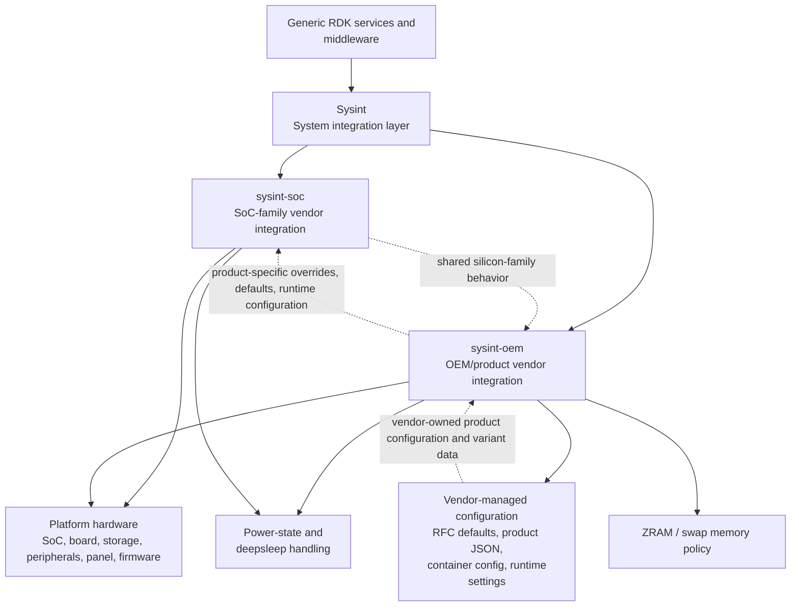

# Sysint (System-Integration) HAL Documentation

## 1. Overview

Sysint is the system-integration layer in the RDK platform stack that adapts the generic middleware runtime to the actual hardware and product implementation. It provides the platform-aware behavior required for boot sequence management, device readiness, storage handling, identity propagation, reset and recovery flows, diagnostics, and product lifecycle operations.

This document defines the vendor-layer responsibilities for Sysint in RDK-M device integrations. It covers the two vendor-specific implementation layers that adapt the generic Sysint behavior to the target platform:

* `sysint-soc`: SoC-family integration that is common across devices built on a shared silicon family.
* `sysint-oem`: OEM or product-specific integration for the board, panel, storage, peripheral, and product variant.

The requirements in this document are intentionally generic. They do not prescribe vendor names, SoC names, board names, panel types, or product-specific implementation details. Instead, they define the required outcomes, dependencies, and lifecycle behavior that must be satisfied by the vendor layer for Sysint to operate correctly and consistently across supported platform variants.

## 2. Architectural Context

In this architecture:

* Generic RDK services depend on Sysint for platform-aware behavior and lifecycle readiness.
* Sysint acts as the integration boundary between platform-neutral middleware and the device-specific implementation environment.
* `sysint-soc` provides the baseline behavior shared by devices using the same silicon family, including SoC capability checks, dependency readiness, and silicon-family level recovery requirements.
* `sysint-oem` extends or overrides that baseline for the actual board, product, storage, panel, peripheral, and product-variant configuration.
* The vendor layer owns product-specific configuration data, including RFC/default values, product-specific runtime metadata, container configuration, and component-specific JSON payloads required by the target platform.
* Power-state and deep-sleep behavior, ZRAM/swap memory handling, and runtime recovery are treated as Sysint-relevant vendor responsibilities rather than generic middleware concerns.
* The generic Sysint layer remains independent from silicon names, product names, and vendor-specific implementation details, while the vendor layer is responsible for all platform assumptions and product-specific behavior.

## 3. Scope

This document applies only to Sysint-related vendor implementation responsibilities. It excludes unrelated platform requirements and non-Sysint product features that are not required for Sysint behavior.

The vendor layer is responsible for:

* Adapting platform-specific hardware behavior required by Sysint,
* Supplying the configuration and dependencies needed for Sysint to initialize and operate reliably,
* Ensuring platform-specific recovery, reset, and diagnostic behavior is correct,
* Preserving product safety, data integrity, and supported variant semantics.

The generic Sysint layer remains independent of the specific silicon family or product design. The vendor layer must contain all implementation assumptions that are platform-specific.

## 4. Vendor-Layer Responsibilities

### 4.1 `sysint-soc` responsibilities

The SoC vendor layer is responsible for the baseline integration shared by devices built on the same silicon family.

It shall:

* Provide the platform configuration required for the Sysint execution model,
* Maintain the `sysint-soc` implementation sources, scripts, SoC-family properties/configuration in the designated vendor-controlled SoC integration repositories,
* Initialize SoC-level drivers, interfaces, and dependencies required by Sysint,
* Expose hardware capabilities that are common to the supported silicon family,
* Maintain variant-aware behavior for supported silicon revisions and sub-families,
* Ensure required interfaces and device nodes are available before Sysint-dependent services are invoked,
* Report unsupported or unavailable SoC features explicitly instead of masking failure conditions,
* Provide SoC-level recovery behavior for failed initialization or degraded platform states.

Required outcomes:

* SoC capability detection and variant selection are correctly implemented.
* Required device nodes, interfaces, and firmware dependencies are available during the platform startup sequence.
* Failure or absence of a required SoC function is exposed clearly to dependent layers.
* Recovery behavior is defined for interrupted or partially initialized SoC-specific operations.

### 4.2 `sysint-oem` responsibilities

The OEM vendor layer is responsible for the board, product, and device-specific behavior that extends the SoC layer.

It shall:

* Define the board and product configuration used by Sysint for the supported device variant,
* Maintain the `sysint-oem` implementation sources, recipes, patches, scripts, and product configuration, including any product-specific `imageFlasher` implementation, in the designated vendor-controlled OEM integration repositories,
* Provide OEM-specific startup sequencing, dependencies, and runtime defaults required by Sysint,
* Integrate board-specific storage, panel, peripheral, and product-level behaviors,
* Support variant-specific overrides or extensions without modifying the generic Sysint implementation,
* Define the product-specific reset, recovery, and diagnostics behavior needed for Sysint operations,
* Ensure that unsupported board or product features are declared as unsupported rather than treated as functional defaults.

Required outcomes:

* Board and product variants are selected correctly.
* Product-specific configuration is available before Sysint-dependent services start.
* Hardware and storage assumptions are contained within the OEM layer.
* Product-level recovery and failure reporting is defined for the supported device configuration.

## 5. Common Vendor Requirements

The vendor layer shall satisfy the following Sysint-specific requirements for every supported device variant.

### 5.1 Device configuration and boot sequencing

The vendor layer shall provide the configuration and initialization state required for Sysint to operate correctly.

It shall:

* Define the hardware and platform configuration for the active device variant,
* Ensure the required interfaces and dependencies are available at the correct stage of startup,
* Make configuration variant-aware for SoC, board, and product differences,
* Avoid hard-coded assumptions that are incompatible with other supported device variants,
* Fail explicitly when a required prerequisite is missing or cannot be initialized.

### 5.2 Hardware capability and interface readiness

The vendor layer shall expose only those capabilities that are present and supported for the target platform.

It shall:

* Declare which Sysint-related interfaces, devices, or hardware services are supported,
* Initialize supported interfaces and device nodes in the correct ordering,
* Report unsupported capability states clearly,
* Avoid enabling hardware features for variants where they are absent or invalid,
* Keep the implementation aligned with the device's actual hardware and product profile.

### 5.3 Storage and product data handling

The vendor layer shall provide the storage and persistence behavior required by Sysint for the supported product.

It shall:

* Define the storage layout, mount points, and persistable data requirements relevant to Sysint,
* Initialize required storage before dependent Sysint operations rely on it,
* Protect boot-critical, identity, and product-specific data from destructive or incorrect operations,
* Handle storage failures or missing persistence in a defined and observable manner,
* Ensure reset or maintenance operations apply only to the correct storage scope for the target product variant.

### 5.4 Reset, reboot, and maintenance behavior

The vendor layer shall integrate product-specific reset and maintenance behavior with Sysint lifecycle expectations.

It shall:

* Support the reset and reboot flows required by the product and Sysint contract,
* Protect data outside the reset scope,
* Safely quiesce relevant services before destructive operations,
* Leave the system in a defined post-reset or post-reboot state,
* Expose the reset or reboot reason where required by the platform lifecycle,
* Define recovery actions for interrupted or failed maintenance flows.

### 5.5 Firmware and update integration

When the platform supports firmware or system update workflows relevant to Sysint, the vendor layer shall provide the required integration.

It shall:

* Validate compatibility with the hardware and product variant,
* Provide and maintain a product-specific image flashing implementation, such as `imageFlasher.sh`, when required by the supported platform,
* Validate the image format, version, integrity, target device, and flashing preconditions before writing any image data,
* Prevent writes to unauthorized or incorrect targets,
* Coordinate update operations with reboot and maintenance sequencing,
* Expose failure conditions clearly,
* Define recovery behavior for interrupted or unsuccessful update operations,
* Ensure the flashing script is executed only with the required privileges and does not bypass platform security, storage protection, or Sysint lifecycle controls.

The product-specific image flashing implementation shall remain within the `sysint-oem` responsibility and shall be maintained with the corresponding OEM platform sources and configuration. It shall not introduce product-specific assumptions into the generic Sysint layer.

### 5.6 Device identity and product metadata

The vendor layer shall supply the identity and product metadata required by Sysint and its consumers.

It shall:

* Provide stable product identity values for the supported platform,
* Source values from the correct device-owned location,
* Return unavailable or unsupported values explicitly,
* Protect access to sensitive or restricted manufacturing data,
* Keep identity data consistent with the active device variant.

### 5.7 Diagnostics and observability

The vendor layer shall expose sufficient platform and device state for Sysint to diagnose problems without exposing protected data.

It shall:

* Provide diagnostics for startup, boot, storage, reset, and hardware-related failure states,
* Preserve relevant crash, reboot, or maintenance data as required by the device lifecycle,
* Ensure diagnostics are available without interfering with critical operations,
* Apply the product security policy to logs and diagnostic data,
* Report failure states in a manner that supports debugging and recovery.

### 5.8 Power-state and deep-sleep support

For devices that support managed low-power states, the vendor layer shall provide the Sysint-relevant behavior required to safely transition between active, standby, and deep-sleep states. In RDK-E platform integrations, power-state transitions are a Sysint concern because they directly affect device readiness, wake-up reliability, connectivity restoration, and post-resume recovery behavior.

It shall:

* Define the supported power states for the target device variant and the transition conditions for each state,
* Prepare required hardware, device, and platform state before entering a low-power or deep-sleep state,
* Restore wake-up state, connectivity context, and required runtime dependencies after resume,
* Prevent entry into low-power states while critical update, reset, storage, or recovery operations are in progress,
* Preserve the wake-up reason and other required state needed for correct post-resume behavior,
* Detect unsuccessful or partial power transitions and leave the platform in a recoverable state,
* Ensure power-state behavior does not invalidate Sysint assumptions related to identity, storage, or recovery flow.

Required outcomes:

* Devices enter and exit low-power states only when the platform is in a safe and consistent state.
* Wake-up behavior is deterministic and compatible with the supported product variant.
* Critical services remain available or recoverable after resume without silent state loss.
* The platform remains observable and recoverable when deep-sleep or power transitions fail.

### 5.9 ZRAM / Swap support

From the `sysint-oem` perspective, the OEM vendor layer shall treat ZRAM and swap as a single memory-optimization capability and shall define the product-specific behavior for the enabled configuration. The active implementation shall be a compressed RAM-backed swap device that is created and validated during startup as part of the platform memory policy. It shall not depend on slow or untrusted secondary storage for the active swap backing device and shall be aligned with the kernel configuration scope supported by the target platform.

It shall:

* Define whether the product enables ZRAM/swap by default or disables it by default,
* Treat ZRAM and swap as one integrated capability, with the active swap device always compressed and always backed by RAM,
* Ensure the kernel configuration scope is compatible with the supported product profile, including the required ZRAM and swap options for the target kernel,
* Initialize the memory-optimization feature automatically at boot when enabled, without requiring additional runtime configuration steps or late discovery,
* Disable the feature completely when the product variant is configured to disable it, including removal of kernel and vendor-layer support for ZRAM/swap,
* Ensure that a disabled configuration does not leave stale, duplicate, partially initialized, or silently enabled swap state,
* Apply the relevant low-memory configuration for 32-bit kernel profiles when ZRAM/swap is disabled or constrained, in order to avoid premature OOM conditions,
* Never configure the active ZRAM/swap device from slow, insecure, or secondary storage media,
* Keep the memory optimization behavior within the supported product memory envelope and product-defined safe limits,
* Prevent start-up, reset, or recovery flows from creating conflicting or duplicate swap devices,
* Validate the active swap configuration before use and report configuration, activation, or degraded-state failures in a visible and actionable manner,
* Define recovery behavior when ZRAM/swap cannot be activated, is degraded, or is interrupted during startup or reset.

Implementation requirements derived from the platform model:

* The ZRAM/swap implementation shall be treated as a single product-level feature and shall be configured consistently across startup, recovery, and reset flows.
* When enabled, the active swap device shall always be compressed and resident in RAM and shall not be backed by persistent or secondary storage.
* When disabled, the kernel configuration and vendor layer shall not provide or activate ZRAM/swap support for the target product variant.
* The kernel and vendor configuration shall be aligned to the selected product mode; a disabled product shall not expose partially enabled support or silently fall back to unsupported behavior.
* Memory sizing, compression policy, and device count shall be consistent with the target platform memory profile and the supported kernel features.
* The swap device shall be initialized with the required swap signature before activation, and activation shall use the platform-supported swap mechanism with the product-defined priority.
* The configuration shall be validated at startup and during recovery flows to ensure that active swap state is complete and consistent.

Required outcomes:

* ZRAM/swap is either consistently enabled by default or consistently disabled by default for the product, according to the supported platform profile.
* The active memory-optimization function is always RAM-backed and compressed when present.
* Boot-up succeeds without requiring additional post-startup configuration for enabled products.
* Disabled products do not expose ZRAM/swap functionality and do not rely on unsupported kernel or vendor behavior.
* The 32-bit low-memory configuration remains safe and prevents premature OOM conditions when the feature is disabled or limited.
* The platform does not use slow or insecure storage as the backing medium for ZRAM/swap.
* Failure or degraded memory state remains observable and recoverable without silent platform misconfiguration.

## 6. Lifecycle Expectations

All vendor-layer Sysint implementations shall satisfy the following expectations:

* Variant-aware behavior: configuration and implementation must reflect the active SoC, board, and product variant.
* Correct startup ordering: required dependencies shall be initialized before dependent Sysint behavior is used.
* Explicit failure handling: a failed Sysint-related operation must be observable and not silently reported as success.
* Recovery behavior: the platform shall define how to recover from interruption, failed startup, missing hardware, or incomplete state.
* Data protection: identity, security, and boot-critical data shall be preserved outside the intended reset or maintenance scope.
* Security compliance: privileged operations, diagnostics, and sensitive platform information shall be controlled according to policy.

## 7. Acceptance Criteria

A vendor-layer Sysint implementation is accepted only when:

1. The required `sysint-soc` and `sysint-oem` behaviors are present for the supported device variants,
2. The implementation is generic enough to support the intended platform family without requiring changes to the generic Sysint layer,
3. Required dependencies are initialized in the correct order,
4. Failure, recovery, and reset conditions are defined and observable,
5. Product data outside the supported scope is preserved and protected,
6. The implementation works correctly across the supported family of products and variants.

## 8. Non-Prescriptive Implementation Rule

This document does not mandate a specific executable name, service manager, configuration path, kernel module, script type, or programming language. The vendor layer may implement the required behavior using any suitable technology, provided it satisfies the Sysint requirements defined in this document.

## 9. Product-Specific RFC and Default Configuration

The vendor layer shall treat product-specific RFC settings and platform defaults as OEM-controlled configuration data that is applied to the supported product variant. These values may be represented in vendor-owned configuration files such as device-specific default payloads or partner default configuration bundles, and they shall be used to tune product behavior without altering the generic Sysint contract.

It shall:

* Keep RFC and default configuration entries under the vendor layer responsibility for the supported product variant,
* Apply product-specific RFC values only after the required platform, variant, and dependency checks are satisfied,
* Ensure that RFC data does not override or bypass the generic Sysint safety, recovery, or lifecycle requirements,
* Validate required RFC entries before startup dependencies rely on them,
* Provide safe fallback behavior when a product-specific RFC value is missing, unsupported, or invalid,
* Keep RFC configuration scoped to the device variant and product profile, without introducing cross-variant or cross-platform assumptions,
* Ensure that RFC configuration does not create conflicting or stale runtime state across boot, recovery, or reset flows,
* Store, expose, and recover RFC-related state in a manner consistent with product security and lifecycle expectations.

Required outcomes:

* Product-specific RFC and default configuration is vendor-managed and variant-aware.
* Generic Sysint behavior remains stable and independent of product-specific RFC tuning.
* Missing or invalid RFC settings result in a safe, visible failure or fallback behavior rather than silent misconfiguration.
* Product variant defaults are applied consistently across startup, reset, and recovery flows.

## 10. Vendor-Supplied Component Configuration Requirements

The vendor layer shall provide product-specific configuration data for runtime components and board-level services that are required by the supported platform but are not part of the generic Sysint layer. These configuration files may define service-specific runtime parameters, mount points, socket mappings, access constraints, default values, or other variant-dependent settings needed by the product implementation.

This category includes configuration files such as Rialto-specific or other OEM-controlled JSON definitions used to initialize platform services in a product-aware manner. Such files shall not be treated as generic Sysint behavior. Instead, they shall remain under the vendor-layer responsibility and shall be validated as part of the product lifecycle.

It shall:

* Define the supported component configuration scope for each product-managed service, subsystem, or platform dependency,
* Apply component-level configuration only for the active product variant and only after the required platform and dependency checks are complete,
* Ensure component-specific configuration remains consistent with the generic Sysint lifecycle, including startup, recovery, reset, and maintenance behavior,
* Validate required component settings before dependent services begin using them,
* Preserve required security, identity, and product-state information associated with each configuration payload,
* Prevent stale, duplicate, or conflicting component configurations from being activated during startup or recovery,
* Expose unsupported or invalid component configuration explicitly rather than silently falling back to unsafe defaults,
* Keep component configuration within the product-defined security envelope and platform resource constraints,
* Ensure that vendor-owned component configuration files do not bypass the Sysint safety and lifecycle rules defined elsewhere in this document.

Required outcomes:

* Product-managed component configuration remains variant-aware and product-scoped.
* Runtime services receive valid configuration before they are used by the platform.
* Component-specific configuration does not create silent misconfiguration or conflicting state.
* Vendor-provided configuration artifacts remain aligned with the generic Sysint contract and platform lifecycle expectations.

## 11. Container Configuration Requirements

When the platform includes containerized runtime components, the vendor layer shall provide the configuration and lifecycle behavior required to ensure the runtime environment remains compatible with Sysint and the target product profile. Product-specific container configuration files in the OEM layer may define runtime mount points, socket mappings, log paths, and device access rules required by the supported platform.

It shall:

* Define the supported container runtime model and its product-specific configuration scope without coupling the implementation to a single vendor-specific container technology,
* Ensure required container runtime dependencies, filesystem mounts, device nodes, and socket mappings are available before dependent Sysint operations begin,
* Configure resource limits, startup ordering, and recovery behavior in a manner consistent with the platform memory, storage, and boot constraints,
* Preserve required security, identity, and product-state information across container startup, restart, and recovery flows,
* Keep container lifecycle behavior aligned with the platform boot sequence and with any reset, reboot, or maintenance operation defined by Sysint,
* Provide the product-specific log, control, and system-state access paths required by the platform without exposing unsupported or insecure interfaces,
* Handle container startup, restart, and failure conditions in a visible and recoverable manner,
* Ensure containerized components do not bypass product-specific safety, storage, or identity requirements,
* Prevent stale, duplicate, or conflicting container runtime state from interfering with device readiness or Sysint recovery behavior,
* Keep the active container runtime configuration within the product-defined security and safety envelope for the target platform.

Implementation examples from vendor-layer product configurations:

* Product-specific mount mappings may be used to connect runtime log paths or system sockets to required host locations.
* Product-specific runtime definitions may expose controlled access to platform logging and system-state interfaces such as syslog or journal sockets.
* Container configuration may be variant-aware and product-specific while remaining generic in the Sysint specification itself.

Required outcomes:

* Containerized runtime behavior is consistent with the supported product variant and platform lifecycle.
* Required dependencies are initialized in the correct order before the containerized environment is used.
* Product data, identity, and security-sensitive state remain protected across runtime transitions.
* Container failures are observable and recoverable without compromising Sysint functionality.
* Product-specific container configuration remains aligned with the generic Sysint contract and vendor-layer responsibilities.

## 12. Acronyms, Terms and Abbreviations

This section defines the key terms used throughout this document.

* `Container runtime` - A product-defined runtime environment for executing packaged or isolated application components, including any required mounts, device access, and lifecycle management.
* `Default configuration` - Product-specific values supplied by the OEM or vendor layer to define the supported device behavior when a platform-specific default is required.
* `HAL` - Hardware Abstraction Layer.
* `Firmware update` - The controlled process of validating and installing an approved software or firmware image for the supported device variant.

* `OEM` - Original Equipment Manufacturer.
* `Product profile` - The supported device or variant configuration used to determine hardware, startup, runtime, and recovery behavior for a given implementation.
* `RDK` - Reference Design Kit.
* `RDK-E` - RDK for Embedded platforms and vendor-specific integrations.
* `RDK-M` - RDK for Multi-screen and managed device ecosystems.
* `RFC` - RDK Feature Control, or product-specific runtime feature configuration managed by the vendor layer.
* `SoC` - System on Chip.
* `Swap` - A kernel-managed memory paging mechanism that uses a configured backing storage or RAM-backed device to extend available memory.
* `Sysint` - The system integration layer that adapts the generic RDK runtime to the actual hardware and product platform behavior.
* `sysint-oem` - The OEM or product-specific vendor implementation layer for board, device, storage, panel, and product-dependent behavior.
* `sysint-soc` - The SoC-family vendor implementation layer for shared silicon-family behavior.
* `Variant-aware configuration` - Platform configuration that is selected and applied according to the active SoC, board, and product variant.
* `Vendor integration repository` - A vendor-controlled source repository that stores SoC-family or OEM/product Sysint implementations, scripts, recipes, patches, and platform-specific configuration.
* `ZRAM` - A compressed RAM-backed block device used as a memory optimization mechanism.

## 13. References

* [RDK Central Sysint](https://github.com/rdkcentral/sysint) - generic Sysint component and public upstream reference.
* [RDK Central organization](https://github.com/rdkcentral) - public upstream RDK component sources and specifications.
* RDK-E vendor-layer source repositories - vendor-controlled repositories that store SoC-family (`sysint-soc`) and OEM/product (`sysint-oem`) Sysint implementations, recipes, patches, and platform-specific configuration. Access may require organization authorization.
